# Linear Enigma

Linear Enigma é um projeto acadêmico desenvolvido como parte do curso de Cálculo Avançado e Álgebra Linear na PUCRS. Este projeto explora o uso da cifra de Hill, uma técnica de criptografia baseada em matrizes, para codificar e decodificar mensagens de forma segura. Através de desafios de codificação, são aplicados conceitos de álgebra modular e inversa de matrizes, consolidando o conhecimento matemático em um cenário prático de segurança da informação.

## Índice

- [Objetivo](#objetivo)
- [Requisitos](#requisitos)
- [Funcionalidades](#funcionalidades)
- [Diagramas](#diagramas)
- [Instalação e Uso](#instalação-e-uso)
- [Licença](#licença)

## Objetivo

O objetivo deste projeto é:
- Aplicar conceitos de Álgebra Linear, como inversa de matrizes, e álgebra modular na prática.
- Desenvolver e decodificar mensagens cifradas usando a cifra de Hill.
- Utilizar a cifra de Hill para simular um cenário de comunicação segura.

## Requisitos

Para seguir o projeto, é recomendável:
- Familiaridade com matrizes e álgebra modular.
- Conhecimentos básicos de programação em Python (ou outra linguagem de preferência).
- Softwares: Python 3, Jupyter Notebook (opcional, mas recomendado para testes e experimentações).

## Funcionalidades

- **Codificação de Mensagens**: Codifica mensagens utilizando uma matriz de segunda ordem em módulo 26.
- **Decodificação de Mensagens**: Decodifica mensagens cifradas usando a matriz inversa.
- **Quebra de Códigos**: Utiliza um algoritmo específico para resolver códigos baseados em pistas parciais.

# Diagramas


## Instalação e Uso

1. **Clone o repositório**:
    ```bash
    git clone https://github.com/usuario/linear-enigma.git
    cd cipher-minds
    ```

2. **Instale as dependências**:
    Caso o projeto utilize dependências específicas em Python, instale-as com o comando:
    ```bash
    pip install -r requirements.txt
    ```

3. **Execute o GUI de codificação e decodificação**:
    execute o arquivo `run.bat`


## Licença

Este projeto está licenciado sob a licença MIT. Veja o arquivo [LICENSE](LICENSE) para mais detalhes.
